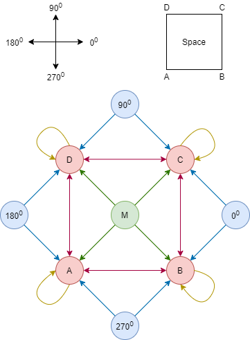

# Robot-Navigation-using-SNNs
Bio-inspired navigation system for artificial agents using spiking neural networks

The navigation task is divided into two parts - 
1. Learning direction (replicated a method from the [paper](Paper.pdf))
2. Learning position (proposed a new method)

### Novel SNN architecture
Developed a novel SNN architecture to determine the position of a robot in a 2D space. For details please refer the [report](Report.pdf). 

  
  
This project is part of Neuromorphic Engineering (EE746 @EE.IITB)

### Team
* [Jayesh Choudhary](https://github.com/Jayesh2000)
* [Preetam Pinnada](https://github.com/preetam25)
* [Srisht Fateh Singh](https://github.com/fateh321)
